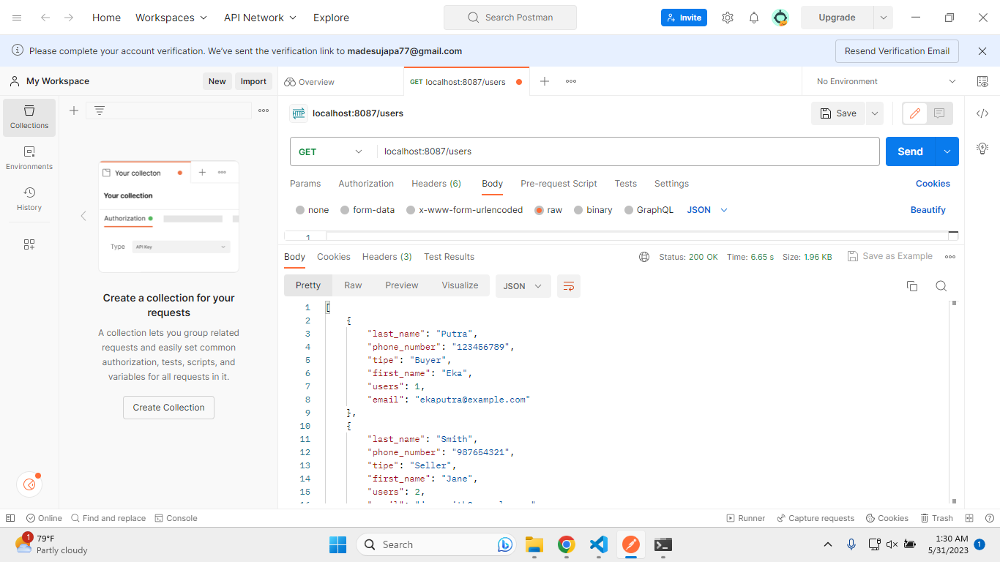
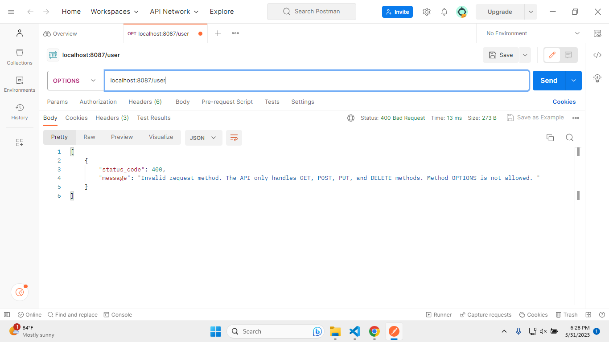
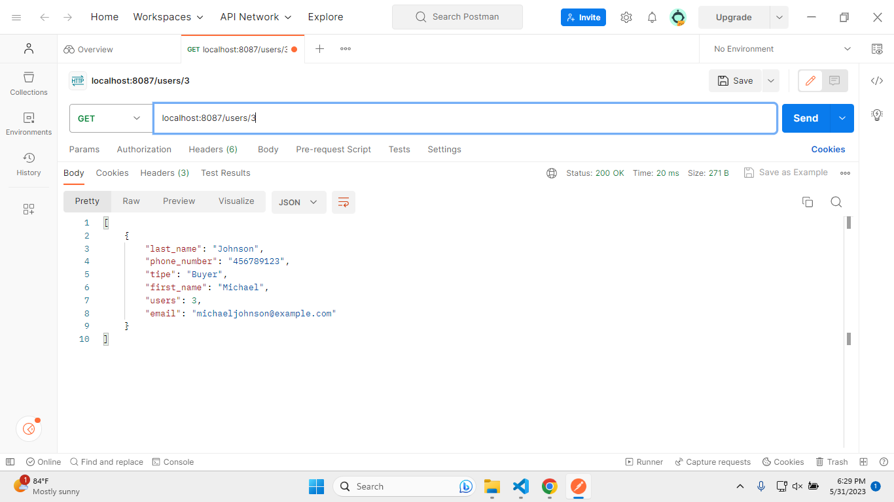
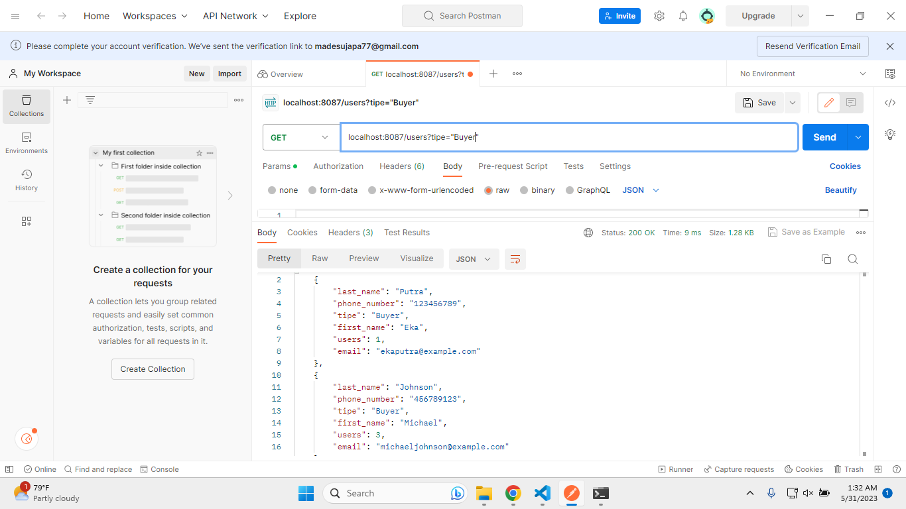
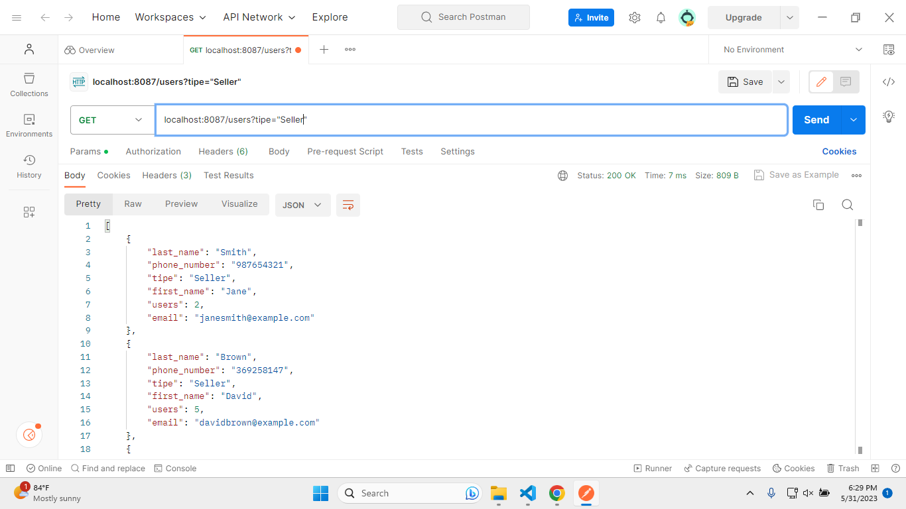
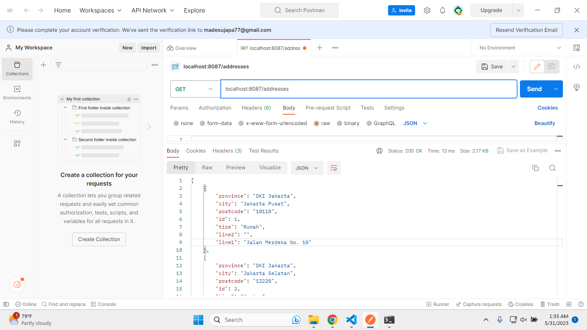

# Java E-Commerce API

<p align = "center">

</p>

## Table of Content

- [About](#about)
- [Identitas](#identitas)
- [Folder Structure](#folder)
- [Library and Module](#library) 
- [Spesifikasi API](#spesifikasi) 
    - [GET Method](#get)
    - [POST Method](#post)
    - [PUT Method](#put)
    - [DELETE Method](#delete)

## About <a name="about"></a>

Java E-commerce API adalah program sederhana yang menyediakan layanan backend untuk aplikasi e-commerce. Program ini memungkinkan aplikasi klien untuk berinteraksi dengan API untuk mengakses dan mengelola data produk, pelanggan, dan pesanan dalam sistem e-commerce.

Program ini dibuat menggunakan Vanilla Java dan bertujuan untuk mengelola data dari database ecommerce melalui penggunaan method GET, POST, PUT, dan DELETE.

Project ini bertujuan untuk memenuhi salah satu tugas dari matakuliah Pemrograman Berbasis Objek - Teknologi Informasi - Universitas Udayana - 2023

## Identitas <a name="identitas"></a>

Nama    : I Putu Eka Putra Juniawan

NIM     : 2205551087

Matkul  : Pemrograman Berbasis Objek (E)

## Folder Structure <a name="folder"></a>

Projek ini terdiri dari beberapa folder sebagai berikut

- `.vscode`: folder untuk menyimpan konfigurasi projek
- `bin`: folder untuk menyimpan file-file biner yang dihasilkan dari proses kompilasi source code Java
- `img`: folder untuk menyimpan gambar-gambar hasil pengujian program
- `lib`: folder untuk menyimpan library
- `Sqlite`: folder untuk menyimpan database
- `src`: folder untuk menyimpan kode program

## Library and Module <a name="library"></a>

`Java E-Commerce API` ini dibangun menggunakan beberapa library modul di antaranya [jackson-databind](https://mvnrepository.com/artifact/com.fasterxml.jackson.core/jackson-databind), [json](https://mvnrepository.com/artifact/org.json/json), dan [sqlite](https://mvnrepository.com/artifact/org.xerial/sqlite-jdbc), 

## Spesifikasi API <a name="spesifikasi"></a>

API ini dapat menjalankan 4 perintah, di antaranya:

### GET <a name="get"></a>

Perintah GET bertujuan untuk mengambil data dari tabel, baik semua data maupun data dengan kondisi tertentu

#### GET table users
</br>

```
localhost:8087/users
```

<p align = "center">

</br>
Menampilkan semua data users
</p>

```
localhost:8087/users/1
```

<p align = "center">

</br>
Menampilkan users dengan id = 1
</p>

```
localhost:8087/users/2
```
<p align = "center">

</br>
Menampilkan users dengan id = 2
</p>

```
localhost:8087/users/3
```
<p align = "center">

</br>
Menampilkan users dengan id = 3
</p>

```
localhost:8087/users?tipe="Seller"
```
<p align = "center">

</br>
Menampilkan users dengan tipe seller
</p>

```
localhost:8087/users?tipe="Buyer"
```
<p align = "center">

</br>
Menampilkan users dengan tipe buyer
</p>

```
localhost:8087/user     -> invalid table name
```
<p align = "center">

</br>
Terdapat pesan error karena path tidak sesuai
</p>

#### GET table addresses
</br>

```
localhost:8087/addresses
```

<p align = "center">

</br>
Menampilkan semua data addresses
</p>


### POST <a name="post"></a>

Perintah POST bertujuan untuk menyimpan data ke dalam tabel

### PUT <a name="put"></a>

Perintah PUT bertujuan untuk memodifikasi data dalam tabel

### DELETE <a name="delete"></a>

Perintah DELETE bertujuan untuk menghapus data dari tabel, baik semua data maupun data dengan kondisi tertentu