# Java E-Commerce API

## Table of Content

- [About](#about)
- [Identitas](#identitas)
- [Folder Structure](#folder)
- [Library and Module](#library) 
- [Spesifikasi API](#spesifikasi) 
    - [GET Method](#get)
    - [POST Method](#post)
    - [PUT Method](#put)
    - [DELETE Method](#delete)

## About 

Java E-commerce API adalah program sederhana yang menyediakan layanan backend untuk aplikasi e-commerce. Program ini memungkinkan aplikasi klien untuk berinteraksi dengan API untuk mengakses dan mengelola data produk, pelanggan, dan pesanan dalam sistem e-commerce.

Program ini dibuat menggunakan Vanilla Java dan bertujuan untuk mengelola data dari database ecommerce melalui penggunaan method GET, POST, PUT, dan DELETE.

Project ini bertujuan untuk memenuhi salah satu tugas dari matakuliah Pemrograman Berbasis Objek - Teknologi Informasi - Universitas Udayana - 2023

## Identitas 

Nama    : I Putu Eka Putra Juniawan

NIM     : 2205551087

Matkul  : Pemrograman Berbasis Objek (E)

## Folder Structure 

Projek ini terdiri dari beberapa folder sebagai berikut

- `.vscode`: folder untuk menyimpan konfigurasi projek
- `bin`: folder untuk menyimpan file-file biner yang dihasilkan dari proses kompilasi source code Java
- `img`: folder untuk menyimpan gambar-gambar hasil pengujian program
- `lib`: folder untuk menyimpan library
- `Sqlite`: folder untuk menyimpan database
- `src`: folder untuk menyimpan kode program

## Library and Module 

`Java E-Commerce API` ini dibangun menggunakan beberapa library modul di antaranya [jackson-databind](https://mvnrepository.com/artifact/com.fasterxml.jackson.core/jackson-databind), [json](https://mvnrepository.com/artifact/org.json/json), dan [sqlite](https://mvnrepository.com/artifact/org.xerial/sqlite-jdbc), 

## Spesifikasi API 

API ini dapat menjalankan 4 perintah, di antaranya:

### GET 

Perintah GET bertujuan untuk mengambil data dari tabel, baik semua data maupun data dengan kondisi tertentu

-   **`localhost:8087/{table}`**

Path untuk GET melihat semua data dalam tabel **`table`**

-   **`localhost:8087/{table}/{id}`**

Path untuk GET melihat semua data dalam tabel **`table`** dengan id **`id`**

-   **`localhost:8087/{table}?{query}`**

Path untuk GET melihat semua data dalam tabel **`table`** dengan kondisi pada **`query`**

#### GET table users

-   **`localhost:8087/users`**

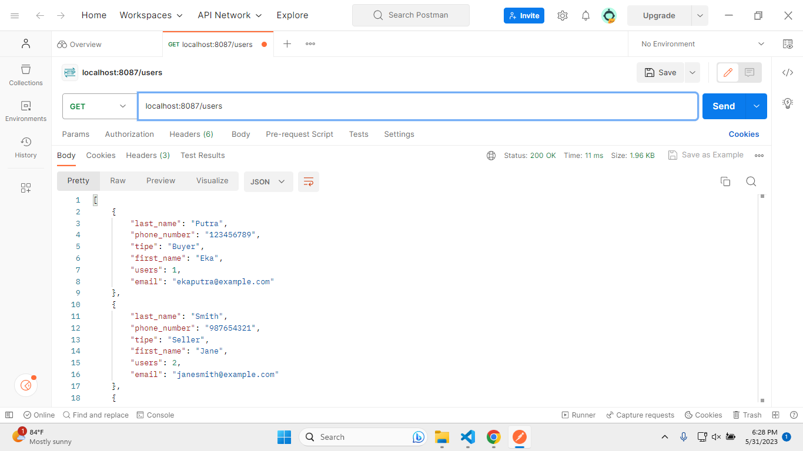
 
Menampilkan semua data users

-   **`localhost:8087/users/1`**

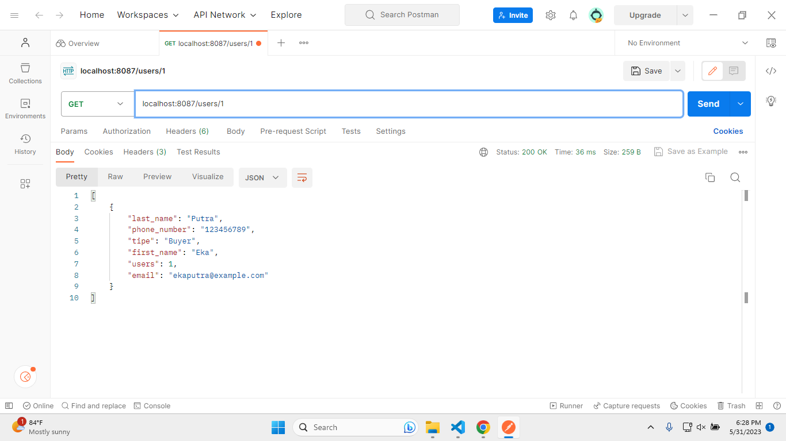
 
Menampilkan users dengan id = 1

-   **`localhost:8087/users/2`**

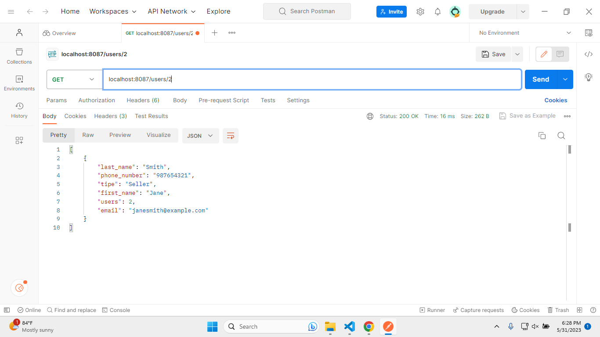
 
Menampilkan users dengan id = 2

-   **`localhost:8087/users/3`**

 
Menampilkan users dengan id = 3

-   **`localhost:8087/users?tipe="Buyer"`**

 
Menampilkan users dengan tipe buyer

-   **`localhost:8087/users?tipe="Seller"`**

 
Menampilkan users dengan tipe seller

-   **`localhost:8087/users?first_name="Emily"`**

 
Menampilkan users dengan nama depan Emily

-   **`localhost:8087/users?last_name="Wilson"`**

 
Menampilkan users dengan nama belakang Wilson

#### GET table addresses

-   **`localhost:8087/addresses`**

 
Menampilkan semua data addresses

-   **`localhost:8087/addresses/1`**

 
Menampilkan data addresses dengan id = 1

-   **`localhost:8087/addresses/2`**

 
Menampilkan data addresses dengan id = 2

-   **`localhost:8087/addresses/9`**

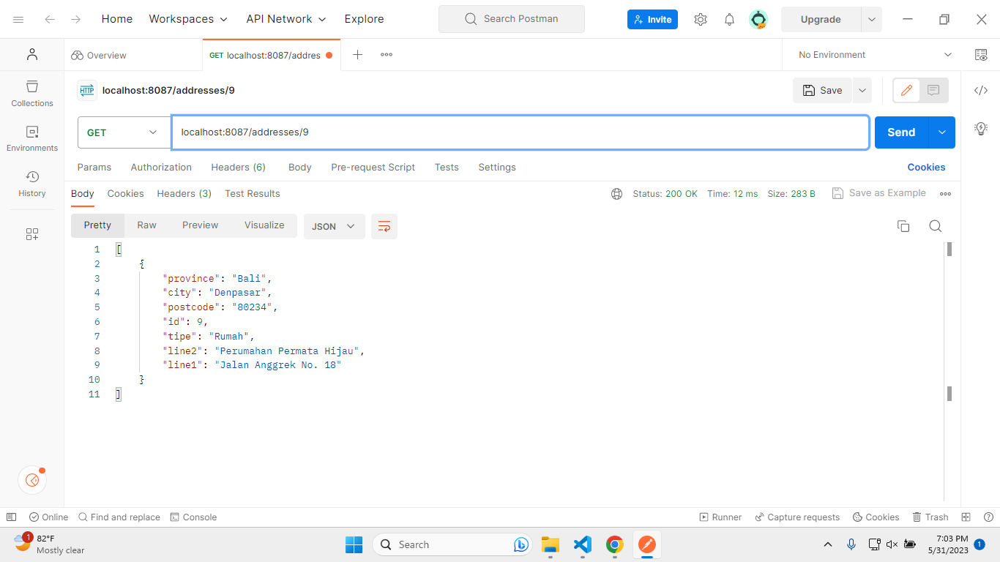
 
Menampilkan data addresses dengan id = 9

-   **`localhost:8087/addresses?city="Medan"`**

 
Menampilkan data addresses dengan alamat kota Medan

-   **`localhost:8087/addresses?tipe="Kantor"`**

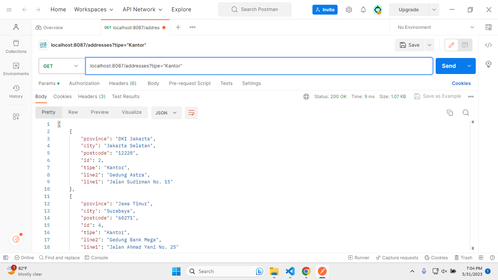
 
Menampilkan data addresses dengan tipe kantor

-   **`localhost:8087/addresses?province="Jawa Timur"`**

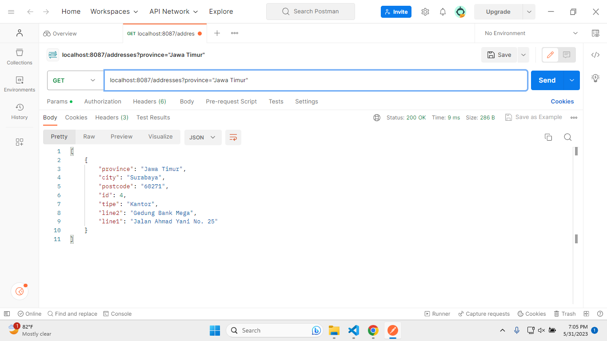
 
Menampilkan data addresses dengan provinsi Jawa Timur

#### GET table products

-   **`localhost:8087/products"`**

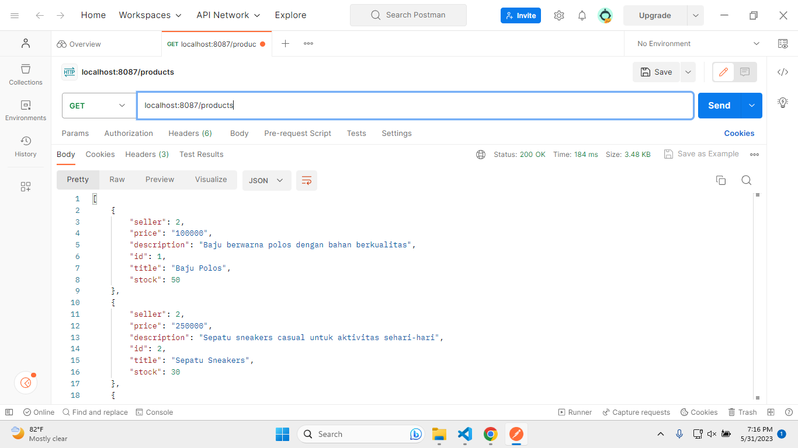
 
Menampilkan semua data products

-   **`localhost:8087/products/1"`**

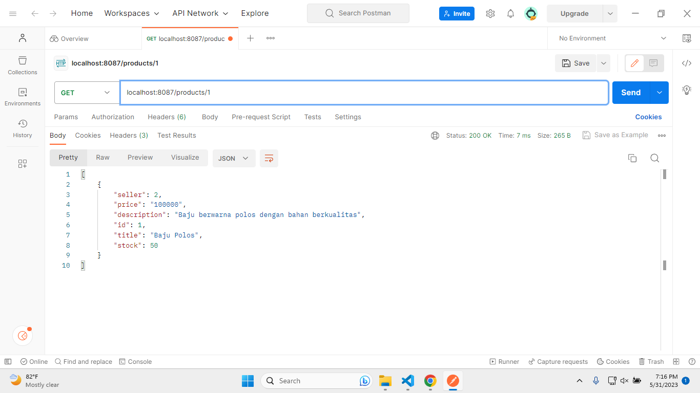
 
Menampilkan data products dengan id = 1

-   **`localhost:8087/products/2"`**

 
Menampilkan data products dengan id = 2

-   **`localhost:8087/products/3"`**

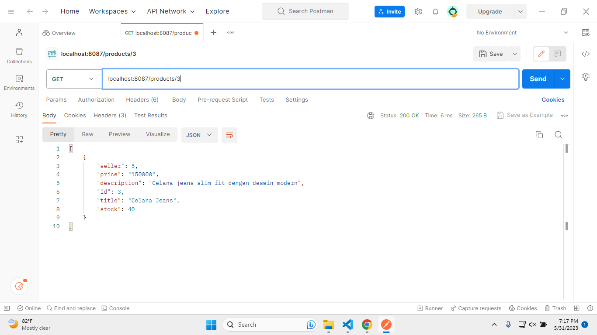
 
Menampilkan data products dengan id = 3

-   **`localhost:8087/products?title="Tas Backpack"`**

 
Menampilkan data products dengan nama tas backpack

-   **`localhost:8087/products?stock<10`**

 
Menampilkan data products dengan stok < 10

-   **`localhost:8087/products?price>750000`**

 
Menampilkan data products dengan harga > 750000

#### GET table orders

-   **`localhost:8087/orders`**

 
Menampilkan semua data orders

-   **`localhost:8087/orders/1`**

 
Menampilkan data orders dengan id = 1

-   **`localhost:8087/orders/2`**

 
Menampilkan data orders dengan id = 2

-   **`localhost:8087/orders/3`**

 
Menampilkan data orders dengan id = 3

-   **`localhost:8087/orders?total<200000`**

 
Menampilkan data orders dengan total < 200000

-   **`localhost:8087/orders?is_paid=false`**

 
Menampilkan data orders dengan status pembayaran false (belum melakukan pembayaran)

-   **`localhost:8087/orders?discount>175000`**

 
Menampilkan data orders dengan diskon > 175000

#### GET table order_details

-   **`localhost:8087/order_details`**

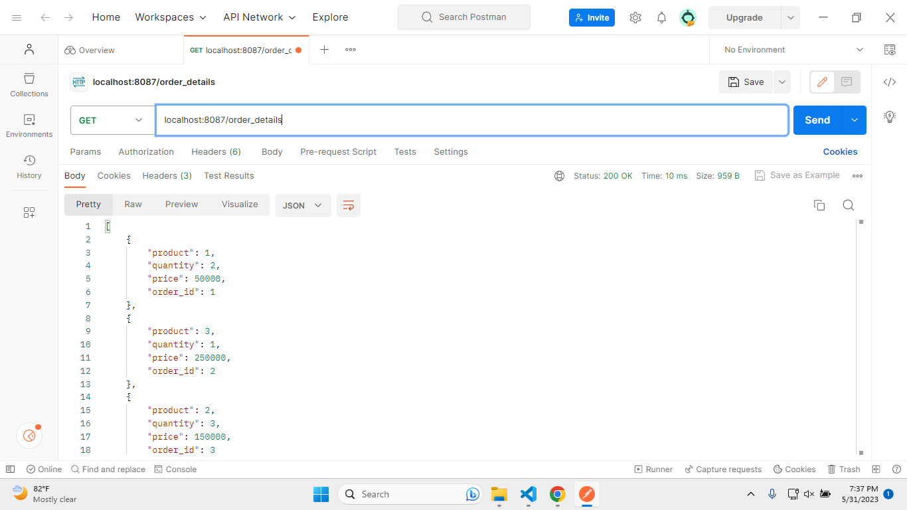
 
Menampilkan semua data order detail

-   **`localhost:8087/order_details/1`**

 
Menampilkan data order detail dengan id = 1

-   **`localhost:8087/order_details/2`**

 
Menampilkan data order detail dengan id = 2

-   **`localhost:8087/order_details/3`**

 
Menampilkan data order detail dengan id = 3

-   **`localhost:8087/order_details?quantity=3`**

 
Menampilkan data order detail dengan banyak barang = 3

-   **`localhost:8087/order_details?price>265000`**

 
Menampilkan data order detail dengan harga > 265000

-   **`localhost:8087/order_details?product=4`**

 
Menampilkan data order detail dengan kode produk = 4

#### GET table reviews

-   **`localhost:8087/reviews`**

 
Menampilkan semua data reviews

-   **`localhost:8087/reviews/1`**

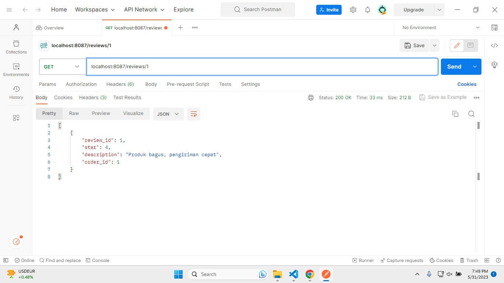
 
Menampilkan data reviews dengan id = 1

-   **`localhost:8087/reviews/2`**

 
Menampilkan data reviews dengan id = 2

-   **`localhost:8087/reviews/3`**

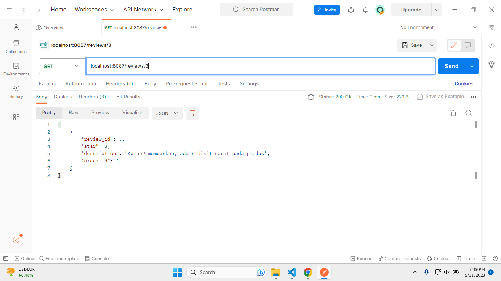
 
Menampilkan data reviews dengan id = 3

-   **`localhost:8087/reviews?star=5`**

 
Menampilkan data reviews bintang 5

-   **`localhost:8087/reviews?description="Produk tidak sesuai gambar"`**

 
Menampilkan data reviews dengan deskripsi tertentu

### POST 

Perintah POST bertujuan untuk menyimpan data ke dalam tabel

### PUT 

Perintah PUT bertujuan untuk memodifikasi data dalam tabel

### DELETE 

Perintah DELETE bertujuan untuk menghapus data dari tabel, baik semua data maupun data dengan kondisi tertentu

### Error Condition 

Jika suatu kondisi yang dilakukan terhadap program tidak terpenuhi, maka akan muncul status code dan message dalam format json seperti berikut

#### Method yang diizinkan hanya GET, POST, PUT, dan DELETE

-   **`PATCH localhost:8087/{table}"`**

 
Error message ketika menggunakan method PATCH

-   **`OPTIONS localhost:8087/{table}"`**

 
Error message ketika menggunakan method OPTIONS

#### Validasi table name

-   **`GET localhost:8087/{invalid-table-name}"`**

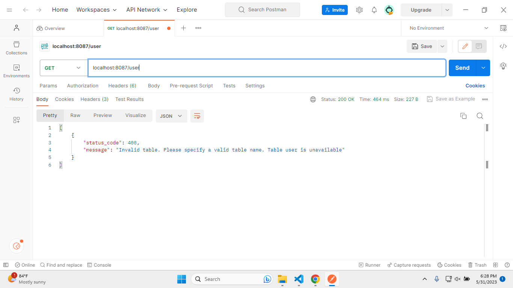
 
Error message ketika menggunakan nama tabel yang tidak tersedia

